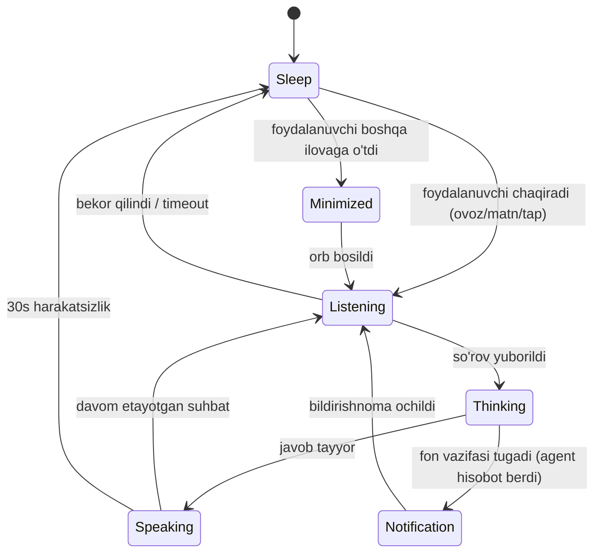

# Bo'lim 10 — Design System (JARVIS/ZET vizual arxitekturasi)

- **Manba:** Ega tomonidan yuklangan 2 ta dashboard mockup (`62538B5C...png`,
  `F79BF99B...png`) + status pill referensi (`IMG_1693.jpeg`) + zarrachali
  moodboard (`IMG_1701.jpeg`).
- **Manba EMAS:** `JARVIS-Presentation.pptx` (40-slaydli taqdimot) — uning
  grafit/teal uslubi faqat slaydlar uchun, mahsulotga tegishli emas (`ADR-0005`).
- Bu hujjat `ADR-0005`dagi token'larni **kengaytiradi** — komponent
  inventarizatsiyasi, sahifa xaritasi, holat mashinasi va Telegram Mini App
  spetsifikatsiyasi bilan.

Bog'liq: `ADR-0005` (token'lar, F-02 yechimi), Bo'lim 10 (P13, DoD: *"Mockup
bilan vizual taqqoslash o'tadi"*).

---

## 1. Token'lar (ADR-0005'dan, o'zgarishsiz)

```css
/* Fon */
--bg-base: #05070D;
--bg-surface: #0A0E17;
--bg-elevated: #0F1420;
--border-subtle: #1A2233;
--border-glow: rgba(74, 158, 255, 0.25);

/* Akцent */
--accent-primary: #4A9EFF;
--accent-cyan: #38BDF8;
--accent-glow: rgba(56, 189, 248, 0.35);

/* Matn */
--text-primary: #E8EDF5;
--text-secondary: #8A97AD;
--text-muted: #4E5A70;
--text-mono: #7BA7D9;

/* Semantik holat */
--state-online: #22C55E;
--state-working: #F59E0B;
--state-thinking: #38BDF8;
--state-offline: #4E5A70;
--state-danger: #EF4444;

/* Shakl */
--radius-panel: 16px;
--radius-card: 12px;
--radius-chip: 999px;
--glass-bg: rgba(15, 20, 32, 0.6);
--glass-blur: 12px;
```

Shrift: **Inter** (matn), **JetBrains Mono** (texnik yorliq/terminal/metrika).
Yorliq uslubi: `UPPERCASE`, `letter-spacing: 0.15em` (mockupda: "SYSTEM
STATUS", "QUICK ACTIONS", "ACTIVE AGENTS").

---

## 2. Ikonografiya va zarracha tili

Mockuplarda ikki qatlamli vizual til bor:

1. **Chiziqli ikonlar (line icons)** — navigatsiya, tugmalar, harakatlar
   uchun. Yupqa chiziq (1.5px), yumaloq uchlar, monoxrom (`--text-secondary`,
   faol holatda `--accent-primary`).
2. **Zarrachali (particle) render** — faqat AI shaxsi uchun: markaziy
   "neyro shar" va profil-bosh. Bular **statik SVG emas** — WebGL/Canvas
   nuqta-bulut animatsiyasi (`IMG_1701` moodboard'i: `[Subject] emerge from
   code... 3d holographic projections made by tiny white dots`).
   - Zichlik holatga qarab o'zgaradi: tinch holatda siyrak va sekin aylanadi,
     "thinking"da zichlashadi va tezlashadi.
   - Rang: oq-ko'k gradient (`--text-primary` → `--accent-cyan`), fon —
     sof `--bg-base`.

**Amalga oshirish eslatmasi:** to'liq WebGL zarracha tizimi (three.js
`Points` + shader) qimmat — MVP uchun CSS/Canvas2D approksimatsiya (nuqta
grid + `radial-gradient` glow) yetarli, keyin almashtiriladi.

---

## 3. Komponent inventarizatsiyasi

Har biri ikkala mockupdan (`62538B5C`, `F79BF99B`) chiqarilgan, aniq
joylashuvi bilan.

### 3.1 Navigatsiya

| Komponent | Tavsif | Holat |
|---|---|---|
| **Sidebar (to'liq)** | Ikon + yorliq, vertikal ro'yxat: Dashboard, AI Assistant, Agents, Projects, Calendar, Tasks, Messages, Files, Analytics, Devices, Camera, Settings | Faol qator — `--accent-primary` fon + oq matn |
| **Sidebar (ixcham)** | Faqat ikon, yorliqsiz — sleep/fokus rejimida | Icon rangi `--text-secondary`, hover `--text-primary` |
| **Bottom dock** | Gorizontal, markazda katta doira tugma (AI trigger/mikrofon), atrofida 8-10 ikon | Markaziy tugma har doim `--accent-glow` halo bilan |
| **Top bar** | Chap: sana/vaqt. Markaz: qidiruv (mikrofon ikoni bilan). O'ng: profil, bildirishnoma (badge), kamera, sozlama ikonlari | Badge — qizil doira, oq raqam |

### 3.2 AI Assistant (markaziy element)

| Holat | Vizual | Matn |
|---|---|---|
| **Sleep** | Yirik, sekin aylanuvchi zarrachali shar (globe/network tugunlari, chiziqlar bilan bog'langan) | "Everything is under control. I'm here when you need me." (suzuvchi karta) |
| **Listening** | Profil-bosh (nuqtalardan), atrofida bitta yupqa halqa glow, pastda ko'k waveform (audio amplituda) | "I'm listening..." + "{Ism}, qanday yordam beray?" |
| **Thinking** | Zarrachalar zichlashadi, halqa tezroq aylanadi, rang `--state-thinking` ga o'tadi | — |
| **Minimize** | Kichik suzuvchi orb (ekran burchagida, 56px), yengil glow | Bosilganda chat bubble chiqadi |
| **Notification** | Orb ustida qizil badge (son bilan) | — |

**Holat mashinasi (Mermaid):**



### 3.3 Status pill / chip (`IMG_1693`)

Umumiy foydalanish uchun — chat, task card, agent card, istalgan joyda
"jarayon davom etmoqda" ko'rsatish uchun.

```
[icon] Label...
```

- Fon: `--glass-bg` + `backdrop-filter: blur(--glass-blur)`
- Radius: `--radius-chip` (to'liq oval)
- Padding: `10px 18px`
- Icon: 16px, animatsiyali (pulse yoki aylanish — holatga bog'liq)

| Chip | Icon uslubi | Ishlatilishi |
|---|---|---|
| `Thinking....` | Chiziqli, aylanuvchi | LLM javob generatsiya qilmoqda |
| `Searching...` | Nuqtali globus | `web.search`/`youtube.search` chaqirilganda |
| `Solving....` | Nuqtali klaster | Ko'p qadamli reasoning |
| `Agent shaping...` | Uchburchak kontur | Agent Factory yangi agent yaratmoqda |
| `Agent listening...` | Nuqtali doira | Ovoz kiritish qabul qilinmoqda (STT) |

Bu chip'lar to'g'ridan-to'g'ri backend'dagi `RunEvent`/`ToolCall` statusiga
map qilinadi (masalan `tool_name` prefiksiga qarab: `*.search` →
`Searching...`, `agent_factory.*` → `Agent shaping...`).

### 3.4 Ma'lumot kartalari

| Komponent | Tarkib | Manba (backend) |
|---|---|---|
| **Stat card** (kichik, 4 tadan bir qatorda) | Sarlavha + katta raqam + kichik trend | `/api/v1/system/status` |
| **System status card** | ONLINE nuqta + FPS/CPU/GPU/RAM/Disk/Network/Temp grid + sparkline | `SYSTEM MONITOR`, monitoring modul |
| **Agent list item** | Avatar (ikonka) + ism + bo'lim (chap) + status matn rangli (o'ng) | `agents/builtin/*`, `AgentSpec.division` |
| **Project/progress row** | Ikon + nom + subtitle + progress bar + % | Business Factory workflow holati |
| **Progress ring** | Markazda %, atrofida 3 ta stat (Completed/In progress/Pending) | Tasks moduli |
| **Camera tile** | Grayscale/qorong'i preview + kamera nomi + live nuqta | `camera.snapshot`, `devices/camera.py` |
| **Chat bubble** | Qorong'i fon, o'ng — foydalanuvchi (accent chegarali), chap — agent (glass) | Telegram/Mini App suhbat tarixi |
| **Terminal panel** | Monospace, yashil-ko'k matn, tab (Terminal/Logs/System) | `shell.exec`, observability log stream |
| **Notification card** | Kichik orb avatar + agent nomi + xabar + "N daqiqa oldin" + X | `RunEvent` → foydalanuvchiga push |

### 3.5 Boshqaruv elementlari

- **Accent color picker** (Settings → Appearance): rangli doira svatch'lar
  qatori (yashil/orange/pink/purple/blue/red) — foydalanuvchi
  `--accent-primary`ni o'zgartira oladi. Default: ko'k.
- **Toggle switch**: yoqilganda `--state-online` yashil fon, o'chirilganda
  `--bg-elevated` + `--border-subtle`.
- **Dropdown** (Theme/Language/Timezone): glass panel, `--border-subtle`
  chegarali, ochilganda `--border-glow`.

---

## 4. Sahifa xaritasi (Web Dashboard)

Sidebar tartibi bo'yicha, har biri backend endpoint/modul bilan bog'liq:

| # | Sahifa | Backend manbasi |
|---|---|---|
| 1 | **Dashboard** | Barcha panellarning qisqa xulosasi (hero + kartalar) |
| 2 | **AI Assistant** | `orchestrator`, `RoutedLLMProvider`, voice STT/TTS |
| 3 | **Agents** | `agents/builtin/*`, `agents/eval.py` (Factory) |
| 4 | **Projects** | Business Factory workflow'lari |
| 5 | **Calendar** | `automation/scheduler.py`, cron |
| 6 | **Tasks** | `automation/executor.py`, run lifecycle |
| 7 | **Messages** | Telegram/Mini App suhbat tarixi |
| 8 | **Files** | `note.write/read/list`, vault |
| 9 | **Analytics** | `youtube.*`, `instagram.*`, `telegram.channel_stats` |
| 10 | **Devices** | `devices/desktop.py` (Bo'lim 11 — ekran/klaviatura) |
| 11 | **Camera** | `devices/camera.py`, `camera.snapshot` |
| 12 | **Settings** | `config.py` Settings — UI orqali ko'rinadigan (sirlar emas!) qismi |

⚠️ **Xavfsizlik eslatmasi:** Settings sahifasida hech qanday `SecretStr`
qiymat (`.env`dagi tokenlar) frontend'ga chiqmasligi kerak — faqat
"sozlangan/sozlanmagan" holat (bool) ko'rsatiladi.

---

## 5. Telegram Mini App — ekran spetsifikatsiyasi

Mockupda 6 ta asosiy ekran (`F79BF99B`, pastki qator):

1. **Chat** — markaziy profil-bosh hologram + "I'm listening..." + input
   (matn/ovoz). Bosh ekran, `/start` bosilganda ochiladi.
2. **Agents** — tab (Barchasi/Faol/Offline/To'xtatilgan) + ro'yxat (status
   rangli matn).
3. **Projects** — ro'yxat, progress %.
4. **Tasks** — tab (Barchasi/Bugun/Kutayotgan/Bajarilgan) + progress ring +
   vaqt bilan ro'yxat.
5. **Camera** — tab (Live/Events/Timeline) + grid + "Barcha kameralarni
   ko'rish" tugmasi.
6. **Settings** — ro'yxat qatorlari (chevron bilan) + til (O'zbekcha
   default) + "Tungi rejim" toggle.

**Texnik eslatma:** Telegram Mini App — `telegram-web-app.js` SDK orqali
ochiladigan web view (`WebApp.initData` bilan autentifikatsiya, owner_id
tekshiruvi R-04 bo'yicha). Backend — mavjud FastAPI `/api/v1/*`
endpoint'laridan foydalanadi, alohida API kerak emas.

---

## 6. Amalga oshirish tartibi (Bo'lim 10 uchun tavsiya)

Bu hujjat — **spetsifikatsiya**, hali kod emas. Keyingi qadam sifatida
tavsiya etiladigan tartib:

1. Design token'larni CSS custom properties + Tailwind config sifatida
   kodga o'tkazish (`apps/web/` yangi paket).
2. Statik komponent library (Storybook yoki oddiy HTML) — §3 dagi har bir
   komponent, holatlari bilan.
3. Dashboard sahifasini realtime backend'ga ulash (WebSocket/SSE —
   `RunEvent` stream → status pill'lar avtomatik yangilanadi).
4. Telegram Mini App — alohida, yengilroq bundle (mobil trafik cheklovi).
5. **DoD tekshiruvi:** ikkala original mockup bilan yonma-yon screenshot
   taqqoslash (Bo'lim 10 DoD talabi).

---

## 7. Ochiq savollar

- Zarracha render — Canvas2D approksimatsiya MVP uchun yetarlimi, yoki
  boshidanoq WebGL (three.js) kerakmi? (Ishlash tezligi vs sifat.)
- Gesture control qatori (`SWIPE/PINCH/PULL/PUSH/CIRCLE/PALM` —
  dashboard mockup pastida) — bu real trackpad/kamera-gesture funksiyasimi
  yoki shunchaki vizual konsepsiya? Agar real bo'lsa, alohida qurilma
  ruxsati (A-06 capability token) kerak bo'ladi.
