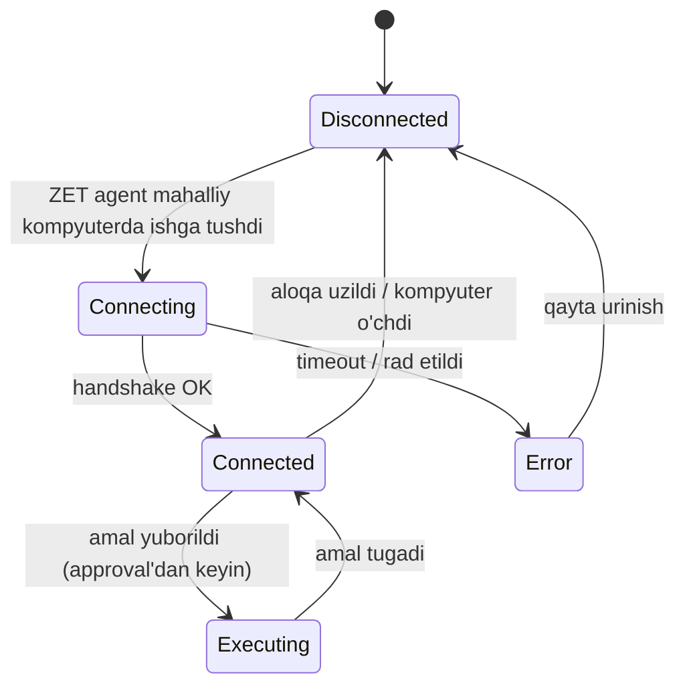

# Bo'lim 10.1 — Devices sahifasi: Kompyuter va Telefon ko'rinishlari

- `docs/10-DESIGN-SYSTEM.md`ning §4 (Sahifa xaritasi, qator #10 "Devices")
  qatorini chuqurlashtiradi. Yangi token/rang kiritilmaydi — `ADR-0005`
  o'zgarishsiz qo'llaniladi.
- Ko'lam manbasi: `features.md` taqdimot **strukturasi** (slayd 23 "Phone
  Control", slayd 24 "Computer Control") — **faqat mavzu ro'yxati sifatida**,
  vizual uslub sifatida EMAS (`ADR-0005` bo'yicha taqdimot uslubi rad
  etilgan).
- Bu ham faqat **arxitektura** — kod yo'q, vizual artifact yo'q.

## 0. Backend holati (muhim — dizayn shuni aks ettirishi kerak)

| Qurilma | Backend | Holat |
|---|---|---|
| **Kompyuter** (Mac/Win) | `devices/desktop.py`, `tools/builtin/desktop_tools.py` | ✅ To'liq — screenshot/type/key/click, hammasi ro'yxatdan o'tgan |
| **Telefon** (egasining shaxsiy qurilmasi) | — | ❌ Yo'q — pastda §3 da tushuntiriladi |
| Approval | `api/routes/approvals.py` | ✅ `GET /approvals`, `POST /{id}/approve`, `POST /{id}/reject` |
| Kill-switch | `api/routes/killswitch.py` | ✅ `POST /killswitch/engage`, `/disengage`, `GET /killswitch` |

`PyAutoGUIDesktop` (haqiqiy Mac/Win drayveri) hali yozilmagan — hozircha
`StubDesktop` (`available=False`). Bu dizayn shuni hisobga oladi:
"Ulanmagan" holat — birinchi darajali UI holat, ikkinchi darajali xato emas.

---

## 1. Devices sahifa tuzilishi

Sidebar → **Devices** ochilganda ikkita tab:

```
┌─────────────────────────────────────┐
│  DEVICES                             │
│  ┌──────────┐ ┌──────────┐           │
│  │ Kompyuter│ │ Telefon  │           │
│  └──────────┘ └──────────┘           │
├─────────────────────────────────────┤
│         (tanlangan tab kontenti)     │
└─────────────────────────────────────┘
```

Tab pill'lari — `--radius-chip`, faol tab `--accent-primary` chegara.
Har ikkala tab yuqori qismida **ulanish holati** (§2.1) doim ko'rinadi —
foydalanuvchi qaysi tabda bo'lishidan qat'iy nazar, "bu qurilma
ishlayaptimi" birinchi savolga darhol javob berilishi kerak.

---

## 2. Kompyuter (Computer Control) view

### 2.1 Ulanish holati — state diagram



| Holat | Badge rangi | Matn |
|---|---|---|
| `Disconnected` | `--text-muted` kulrang nuqta | "Ulanmagan — ZET agentni kompyuteringizda ishga tushiring" |
| `Connecting` | `--state-working` sariq, pulslaydi | "Ulanmoqda..." |
| `Connected` | `--state-online` yashil | "Ulangan — {hostname}, {OS}" |
| `Executing` | `--state-thinking` ko'k, pulslaydi | "Amal bajarilmoqda..." |
| `Error` | `--state-danger` qizil | "{xato matni}" + "Qayta urinish" tugmasi |

`Disconnected` — **default va eng ko'p uchraydigan holat** (server
Railway'da headless ishlaydi, `StubDesktop` unavailable). UI buni xato
sifatida emas, **kutilgan holat** sifatida ko'rsatishi kerak: qisqa
yo'riqnoma bilan ("Bu funksiya faqat ZET'ni o'z Mac/Win kompyuteringizda
ishga tushirsangiz ishlaydi").

### 2.2 Screen mirror panel

- Katta preview karta, `--bg-elevated` fon, `--radius-panel`.
- Tepada **"UNTRUSTED"** yorlig'i (mayda, `--text-mono`, kulrang —
  ogohlantirish emas, ma'lumot: "Bu tasvir tashqi manba, tizim buyruq
  sifatida talqin qilmaydi" — A-05 asosida).
- Screenshot **on-demand** (`desktop.screenshot` har chaqiruvda yangi
  kadr oladi, uzluksiz video EMAS). Shuning uchun:
  - "Yangilash" tugmasi (qo'lda) + ixtiyoriy avto-yangilash interval
    (5s/10s/30s/o'chirilgan — default o'chirilgan, chunki har chaqiruv
    tool-call hisoblanadi).
  - Kadr ustida timestamp ("12:04:33 da olingan").
- **Koordinata tanlash:** preview ustiga bosilganda, ekran o'lchamiga
  nisbatan (x, y) hisoblanadi va pastdagi "Sichqoncha bosish" formasiga
  avtomatik to'ldiriladi (lekin **yubormaydi** — faqat forma to'ldiradi,
  yuborish alohida tugma, chunki bu EXECUTE + approval).

### 2.3 Remote input paneli

Uch bo'lim, gorizontal joylashgan:

| Bo'lim | Element | Backend tool |
|---|---|---|
| **Matn yozish** | Textarea + "Yuborish" | `desktop.type_text` |
| **Tugma bosish** | Hotkey builder — chip'lar qatori (`Ctrl` `Alt` `Shift` `Cmd` + erkin tugma input), "+" bilan qo'shiladi, natija oldindan ko'rinadi: `ctrl+alt+t` | `desktop.key_press` |
| **Sichqoncha** | X/Y raqamli input (yoki §2.2 orqali avto), tugma (chap/o'ng/o'rta), click soni (1/2/3) | `desktop.mouse_click` |

Har uchala forma **"Yuborish"** bosilganda darhol bajarilmaydi — §2.4 ga
o'tadi.

### 2.4 Approval oqimi (V-32) — mavjud API'ga bog'langan

Amal yuborilganda backend `ApprovalService.request_approval()` chaqiradi
(mavjud, `security/approvals.py`). UI quyidagicha ishlaydi:

```
┌─────────────────────────────────────────┐
│ ⏳ TASDIQ KUTILMOQDA                      │
│                                           │
│ desktop.key_press — ctrl+alt+t            │
│ "Terminal ochish uchun hotkey"            │
│                                           │
│ Muddat: 28:41 qoldi  [████████░░] 30 daq  │
│                                           │
│      [ Rad etish ]     [ Tasdiqlash ]     │
└─────────────────────────────────────────┘
```

- Karta maydonlari to'g'ridan-to'g'ri `ApprovalRequest`dan:
  `tool_name`, `reason`, `preview` (dict → o'qiladigan qatorlarga
  formatlanadi), `expires_at` (progress bar + soat:daqiqa countdown).
- **Tasdiqlash** → `POST /approvals/{id}/approve`
  **Rad etish** → `POST /approvals/{id}/reject`
  (Ikkalasi ham mavjud endpoint — yangi backend kerak emas.)
- **Muhim UX qarori:** bu tasdiq **Telegram orqali ham** kelishi mumkin
  (aynan shu owner uchun inline tugmalar allaqachon ishlaydi — Bo'lim 5).
  Dashboard va Telegram **bir xil `ApprovalService`ga** yozadi → qaysi
  birida tasdiqlansa, ikkalasida ham holat yangilanishi kerak (real-time
  sync, WebSocket/polling — Bo'lim 10 asosiy hujjatining §6 qadam 3 bilan
  bog'liq).
- Muddat tugasa (`EXPIRED`) — karta kulrang, "Muddat tugadi, qayta
  so'rang" matni, tugmalar o'chirilgan.

### 2.5 Audit log paneli

- Har bir yuborilgan amal (approved/rejected/expired) — vaqt tartibida
  ro'yxat: `[12:04:12] desktop.key_press "ctrl+alt+t" → ✅ tasdiqlandi → bajarildi (140ms)`.
- Ranglar: bajarildi (`--state-online`), rad etildi (`--state-danger`),
  kutilmoqda (`--state-working`).
- Bu — observability talabi (A-07/V-27) uchun vizual dalil: "JARVIS
  nima qildi" har doim ko'rinadi.

### 2.6 Favqulodda to'xtatish (kill-switch)

- Sahifa tepasida doim ko'rinadigan, qizil chegarali tugma: **"BARCHA
  AMALLARNI TO'XTATISH"**.
- `POST /killswitch/engage` (mavjud endpoint).
- Bosilganda: darhol tasdiqlash so'ralmaydi (bu — favqulodda holat,
  o'zi approval zanjiridan tashqarida) — lekin bosilgach ikkinchi
  darajali "Ishonchingiz komilmi?" mini-tasdiq (oddiy JS confirm emas,
  brendga mos modal) ko'rsatiladi, chunki bu barcha faol run'larni
  to'xtatadi.
- Faollashtirilgach: butun Devices sahifa "🔴 KILLSWITCH FAOL" bannerini
  ko'rsatadi, barcha "Yuborish" tugmalari o'chiriladi, `GET /killswitch`
  holatini poll qiladi.

---

## 3. Telefon (Phone) view — ikki talqin, qaror talab qilinadi

`features.md` outline'ida "Phone Control — secure device pairing" deb
yozilgan, lekin **backend'da hech narsa yo'q**. Bu ikki xil narsani
anglatishi mumkin — F-02 kabi (ADR-0005) yana bitta hal qilinishi kerak
bo'lgan ziddiyat:

| Talqin | Ma'nosi | Holat |
|---|---|---|
| **A — "Telefon = boshqaruv paneli"** | Foydalanuvchi ZET'ni telefonidan (Telegram/Mini App orqali) boshqaradi | ✅ Allaqachon qurilgan — Bo'lim 5 (Telegram bot) + `docs/10-DESIGN-SYSTEM.md` §5 (Mini App). Master plan DoD aynan shu: *"Faqat telefon orqali to'liq ish sikli boshqariladi"* |
| **B — "Telefon = masofadan boshqariladigan qurilma"** | ZET foydalanuvchining telefon ekranini ko'radi/boshqaradi (kompyuter kabi) | ❌ Qurilmagan. Android/iOS **companion app** talab qiladi — bu butunlay yangi, katta ish hajmi (native mobil dastur, alohida repo/til) |

### Tavsiya: **A talqinini asosiy deb hisoblash**

Sabablar:
1. Master plan DoD (Bo'lim 5) allaqachon A'ni tasdiqlagan.
2. B — shaxsiy telefon ekranini masofadan ko'rish — maxfiylik jihatidan
   sezilarli darajada og'irroq (kompyuter — ko'pincha ish qurilmasi;
   telefon — shaxsiy xabarlar, bank ilovalari, fotosuratlar doim
   ochiq turadi). Buning uchun alohida xavfsizlik tahlili kerak
   (yangi Threat Model bo'limi), hozircha ZET konstitutsiyasida
   ko'rilmagan.
3. B uchun backend mutlaqo yo'q — dizaynni "havoda" qurish xato bo'lardi.

### Shunga ko'ra: "Telefon" tab dizayni

Kompyuter tabidan **tubdan farqli** — bu masofaviy boshqaruv paneli emas,
**bog'lanish holati kartasi**:

```
┌─────────────────────────────────────┐
│  📱 TELEFON                          │
│                                       │
│  Bog'langan Telegram: @saidburxon     │
│  Owner ID tekshirildi ✅              │
│  Oxirgi faollik: 3 daqiqa oldin       │
│  Ovozli xabar: yoqilgan (ElevenLabs)  │
│                                       │
│  Bu — asosiy boshqaruv kanali.        │
│  Alohida "masofadan boshqarish"       │
│  funksiyasi mavjud emas (dizayn       │
│  qarori, yuqorida asoslangan).        │
└─────────────────────────────────────┘
```

- Ma'lumotlar manbasi: `settings.telegram_owner_ids`,
  `TelegramPoller` oxirgi faollik logi, `elevenlabs_api_key` bor/yo'qligi
  (bool, hech qachon qiymat emas — Xavfsizlik eslatmasi §4 bilan bir xil
  qoida).
- Agar kelajakda B talqini haqiqatan kerak bo'lsa (ega alohida so'rasa) —
  bu alohida ADR + threat model + yangi backend modul talab qiladi,
  hozirgi hujjat doirasidan tashqarida.

---

## 4. Yangi komponentlar (Bo'lim 10 asosiy hujjatining §3 ga qo'shimcha)

| Komponent | Tavsif |
|---|---|
| **Ulanish holati badge** | §2.1 jadvali — nuqta + matn, 5 holat |
| **Screen mirror frame** | Preview + UNTRUSTED yorliq + timestamp + koordinata bosish |
| **Hotkey builder** | Chip qatori, "+" bilan qo'shish, natija oldindan ko'rinadi |
| **Approval card** | `ApprovalRequest`ga to'g'ridan-to'g'ri map — reason/preview/TTL countdown/2 tugma |
| **Audit log row** | Vaqt + tool + natija (rangli holat) |
| **Kill-switch tugma** | Doimiy ko'rinadigan, ikki bosqichli tasdiq, global banner holati |
| **Device status card (telefon)** | Salomat: nuqta + matn, boshqaruv elementi yo'q (faqat ma'lumot) |

---

## 5. Xavfsizlik jadvali (eval.py TOOL_PERMISSIONS bilan mos)

| Amal | Ruxsat | UI oqibati |
|---|---|---|
| `desktop.screenshot` | READ | Bevosita ko'rsatiladi, approval yo'q — lekin UNTRUSTED yorliq bilan |
| `desktop.type_text` | EXECUTE | Approval karta majburiy |
| `desktop.key_press` | EXECUTE | Approval karta majburiy |
| `desktop.mouse_click` | EXECUTE | Approval karta majburiy |
| Kill-switch | ADMIN-darajali | Ikki bosqichli tasdiq (approval emas, alohida oqim) |

---

## 6. Ochiq savollar

1. **Real-time sync** — Telegram va Dashboard bir xil approval'ni
   ko'rsatishi uchun WebSocket/SSE kerak (Bo'lim 10 asosiy hujjat §6
   qadam 3 bilan bir xil ochiq savol — bu yerda takror ta'kidlanadi,
   chunki Devices sahifasida ayniqsa muhim: foydalanuvchi ko'pincha
   Telegram orqali tasdiqlab, natijani darhol Dashboard'da ko'rmoqchi
   bo'ladi).
2. **`PyAutoGUIDesktop` yo'q** — bu hujjat backend qachon yozilishini
   kutmaydi, lekin UI "Ulanmagan" holatini ishonchli ko'rsatishi kerak
   (placeholder emas, chin holat).
3. **Telefon B talqini** — agar ega buni haqiqatan xohlasa, alohida
   qaror (ADR) va threat model kerak bo'ladi, bu hujjat doirasida emas.
4. **Koordinata tanlash aniqligi** — preview tasvir o'lchami bilan
   haqiqiy ekran o'lchami orasidagi nisbat (DPI/Retina) hisoblanishi
   kerak — amalga oshirishda diqqat talab qiladi.
